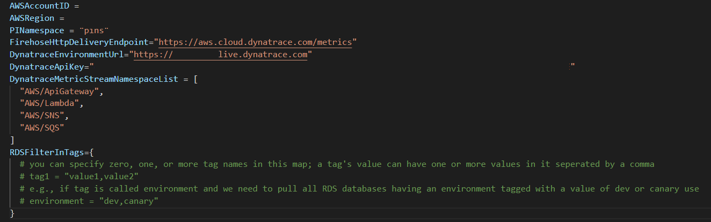
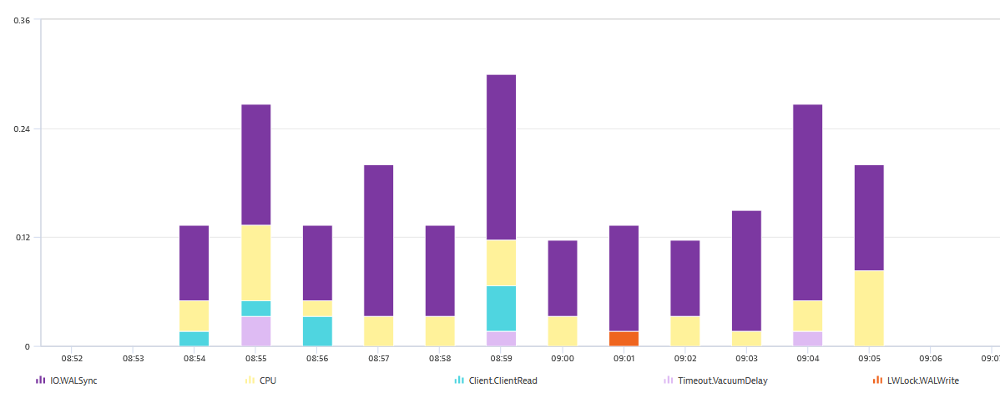
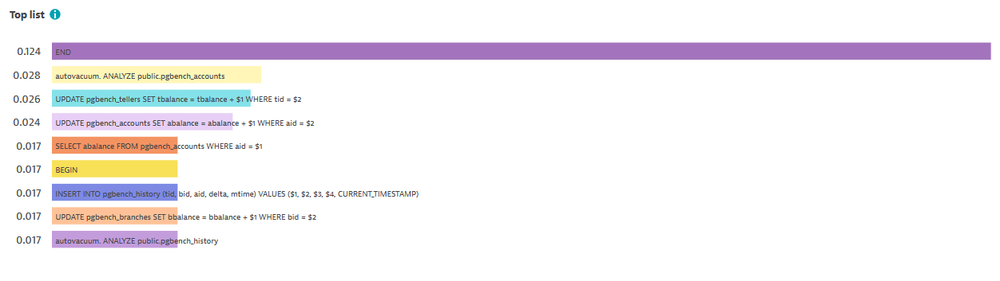
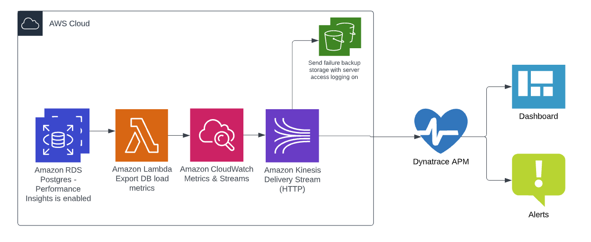
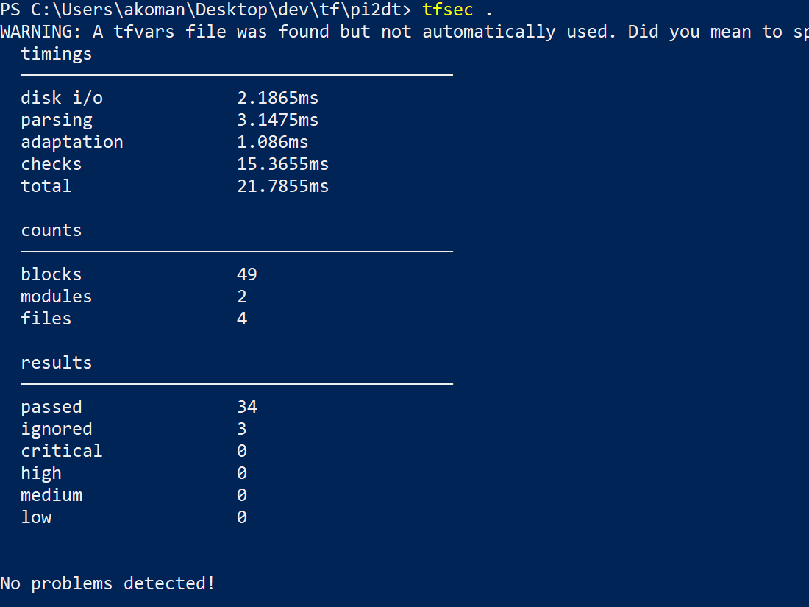

# Background and customer need
Customers want their monitoring tools and operators improve MTTx metrics in order to meet their SLOs. Some of the industry’s most commonly tracked metrics are MTBF (mean time before failure), MTTR (mean time to recovery, repair, respond, or resolve), MTTF (mean time to failure), and MTTA (mean time to acknowledge)—a series of metrics designed to help tech teams understand how often incidents occur and how quickly the team bounces back from those incidents. Customers want to capture these metrics in their monitoring tools as quickly as possible so that their alerting rules will trigger quickly to reduce MTTx. Customers are also looking to minimize the cost of development and operations to integrate metrics from their existing AWS services and new AWS services they use in the future. A specific customer example had a need to monitor Amazon RDS Performance Insights, and additional services like the Amazon EC2 in their monitoring solution. 

# Solution Overview
A solution to push Amazon RDS Performance Insights metrics and Amazon EC2 metrics will be described below. This solution will allow extending the configuration for additional namespaces as needed now or in the future. Dynatrace as a application performance monitoring tool will be used as example for the monitoring destination. This solution will deliver re-usable infrastructure as code using Terraform modules. 

# Solution Interface
- Inputs
    - The terraform code referenced and shared in this project requires you to supply your AWS account, Dynatrace configuration, and other inputs as show below.

    - 

    - See [Main](main.tf) and [Input Variables](terraform.tfvars) for a detailed description of these input variables.

- Output
    - After the infrastructure and code is deployed to your environment, you should expect to see the metrics available for use with alerting and dashboarding as shown below.

    - Database load split by wait 

    - Database load split by SQL 

# Solution design

- Architecture 

- Infrastructure as code 
See code in this project for the Terraform modules. 

- Security checks: [tfsec](https://github.com/aquasecurity/tfsec) is used for static analysis of the terraform code in this project. Results:. 
    - See [notes](tfsec-notes.txt) for details on the ignored checks.

# Steps to run the application end to end
1) Setup an RDS Postgres database and enable performance insights
2) Use a tool like pgBench to create a schema and populate data in a sample database
3) Create a trial account at Dynatrace - use the tokens feature to create your token with "Ingest Metrics" scope. 
4) Make not of the token key, and also make note of your environment URL (first of your url after you login) in Dynatrace 
5) Setup your AWS command line, update the tfvars file with your input values 
6) Run terraform code to create infrastructure and code to push metrics from db to dynatrace
7) Use a tool like pgBench to run SQL for a few minutes
8) Check that you can see the new database load metrics in Dynatrace

# References
- [Deliver Amazon RDS Performance Insights to a third-party APM service provider](https://aws.amazon.com/blogs/database/importing-amazon-rds-performance-insights-counter-metrics-to-amazon-cloudwatch/)
- [Amazon CloudWatch pricing](https://aws.amazon.com/cloudwatch/pricing/)
- [MTTx](https://www.atlassian.com/incident-management/kpis/common-metrics)